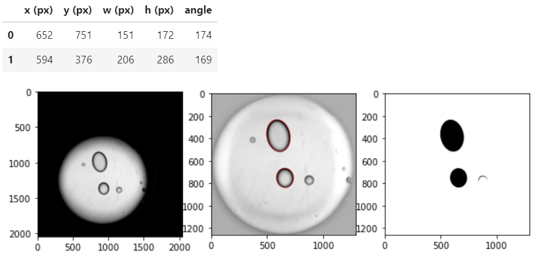
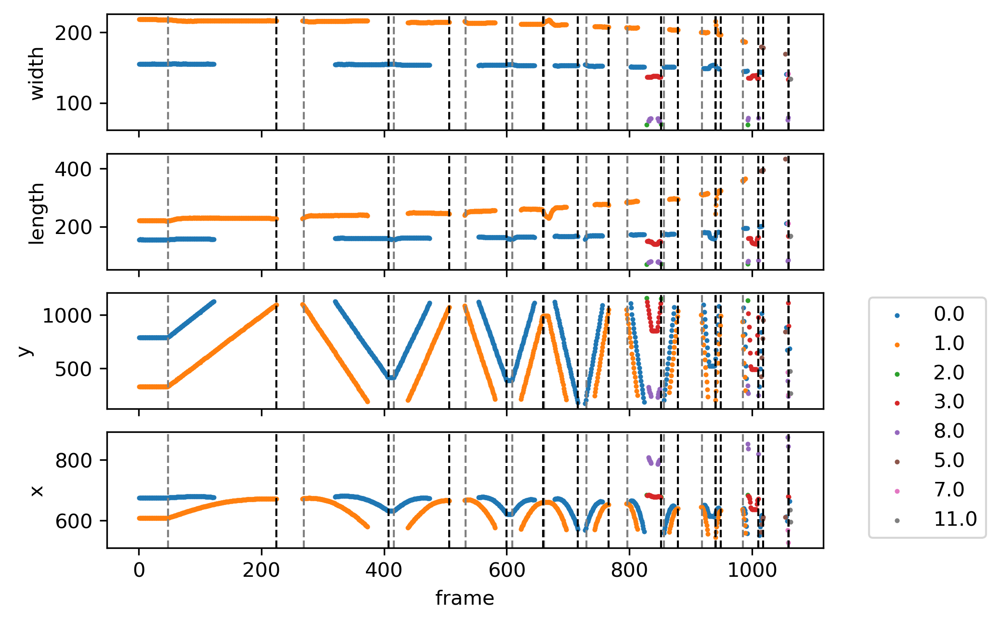
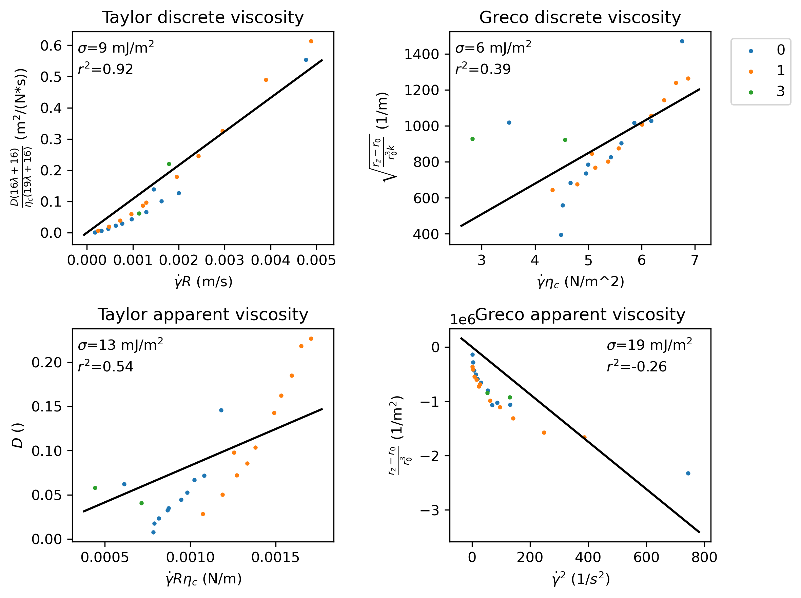

### NIST Repository:
Tools for analyzing videos of droplet deformation for measurement of interfacial tension using a Linkam shear cell
Version 1.0.0

### Authors:
- Leanne Friedrich
    - National Institute of Standards and Technology, MML
    - Leanne.Friedrich@nist.gov

### Contact:
- Leanne Friedrich
    - Leanne.Friedrich@nist.gov

### Description:

This repository contains the following Python tools:

- Tools for analyzing videos of droplet deformation for measurement of interfacial tension using a Linkam shear cell. Droplets were embedded into a layer of fluid, which was sandwiched between two parallel glass plates. An aperture above and below the plates, displaced from the center axis, allow the apparatus to be mounted onto an optical microscope in transmission mode. The shear cell rotates the bottom plate, putting the droplets in shear. This code can analyze videos to track the droplets at different shear rates, at different shear strains, and during relaxation from shear and fit them to models proposed in the literature which correlate droplet shape to surface tension.

--- 

# Usage

This code was structured around videos organized in the following hierarchy:
- [Folders] Type of profile (shear, oscillatory, or relaxation)
    - [Folders] Date and material type
        - [Folders] Material Composition and profile label
            - [Videos] One video for each profile
        - [Txt files] Profile, exported from Linkam software
    
Files were exported in the following hierarchy, to a separate location:
- [Folders] Type of profile (shear, oscillatory, or relaxation)
    - [Folders] Material composition
        - [Folders] Video tag
            - [Videos] Tables (csv) and plots (png) for a single video
            
To reorganize the code based on your file organization, use fileHandling.py and vidRead.py.

The workflow for this code base is as follows:

Do once:
1. Update the Fluid class in fileHandling.py to reflect the naming conventions in your dataset.
2. Update config.yml to reflect your file locations.

To analyze videos:

- Use analyzeRecursive in fileHandling.py or analyzeScript.py to collect data from all videos in the video folder you established in config.yml.

To check your work:

- Check individual folders, videos, and frames using fileHandling.py

The code works as follows:

1. It imports the programmed shear profiles exported by the Linkam software as .mot, as a table
2. For each frame in the video, it crops it to the aperture, masks the area outsie of the aperture, uses Canny edge detection to find droplet interfaces, and uses openCV fitEllipse to measure position and dimensions of each droplet.
 
3. It labels the droplets, so that droplets can be tracked from frame to frame.
4. It matches the programmed shear profiles to actual changes in motion.

5. For each step in the programmed shear profile, it summarizes the droplet shape and uses the velocity to determine the actual shear rate of that droplet.
6. It fits the summaries to the models in the references cited below.

For non-Newtonian droplets in non-Newtonian matrices, we found this method to be inconsistent, as is apparent in the fits shown above, and for Newtonian fluids, we found that the droplet drifted too much to produce useful data. However, this code may be useful for tracking droplets in other material systems.

---

# General Information

Version 1.0.0 was generated: June 2021 -- present

---

# Data Use Notes

This code is publicly available according to the NIST statements of copyright,
fair use and licensing; see 
https://www.nist.gov/director/copyright-fair-use-and-licensing-statements-srd-data-and-software

You may cite the use of this code as follows:
Friedrich, L. (2021), Python tools for shear cell tensiometry, Version 1.0.0, National Institute of Standards and Technology, [doi] (Accessed XXXX-XX-XX)

---

# References

This code fits data for droplets in shear to models proposed in the following papers:

- Birkhofer, B. H., Eischen, J. C., Megias-Alguacil, D., Fischer, P., & Windhab, E. J. (2005). Computer-controlled flow cell for the study of particle and drop dynamics in shear flow fields. Industrial and Engineering Chemistry Research, 44(17), 6999–7009. https://doi.org/10.1021/ie0489296

- Greco, F. (2002). Second-order theory for the deformation of a Newtonian drop in a stationary flow field. Physics of Fluids, 14(3), 946–954. https://doi.org/10.1063/1.1445182

- Megias-Alguacil, D. (2011). Interfacial tension determination of liquid systems in which one of the phases is non-Newtonian using a rheo-optical method. Measurement Science and Technology, 22(3). https://doi.org/10.1088/0957-0233/22/3/037002

- Son, Y., & Migler, K. B. (2002). Interfacial tension measurement between immiscible polymers: Improved deformed drop retraction method. Polymer, 43(10), 3001–3006. https://doi.org/10.1016/S0032-3861(02)00097-6

- Tassieri, M., Grizzuti, N., & Greco, F. (2003). Rheo-optical determination of the interfacial tension in a dispersed blend. Macromolecular Symposia, 198, 53–68. https://doi.org/10.1002/masy.200350806

- Taylor, G. I. (1934). The formation of emulsions in definable fields of flow. Proceedings of the Royal Society of London. Series A, Containing Papers of a Mathematical and Physical Character, 146(858), 501–523. https://doi.org/10.1098/rspa.1934.0169

---

# Data Overview

The files included in this publication use the following hierarchy:

- *README.md*

- *LICENSE*

- **configs/**
    - *config.yml*
        - set path.logs (log folder), path.log_config (logging config yml path), path.c (path to C folder holding OpenFOAM docs), path.e (path to E folder holding OpenFOAM docs), path.server (path to server folder holding OpenFOAM docs), and path.fig (path to figure folder)

    - *logging.yml*
        - set up log generation
        
- **ipynb/**
    - jupyter notebooks and python scripts
    
    - *analyzeScript.py*
        - python script to go through all of the folders and analyze the videos
        
    - *fileHandling.ipynb*
        - Jupyter notebook for collecting data from videos, inspecting data, and inspecting intermediate steps
    

- **logs/**
    - for holding logs

- **py/**
    - python tools
    
    - *config.py*
        - script for importing packages and setting environmental variables, e.g. folders
        
    - *fileHandling.py*
        - tools for moving files around, collecting metadata from folders
        
    - *imshow.py*
        - tools for displaying images in Jupyter notebooks
        
    - *logs.py*
        - tools for logging outputs to file
        
    - *vidCrop.py*
        - tools for cropping images and detecting the aperture in shear cell videos
        
    - *vidMorph.py*
        - tools for using morphological operations to detect and measure droplets in images
        
    - *vidRead.py*
        - tools for handling droplet measurements and importing and exporting droplet tables and plots

--- 

# Version History

Created 06/17/21

---

# METHODOLOGICAL INFORMATION

